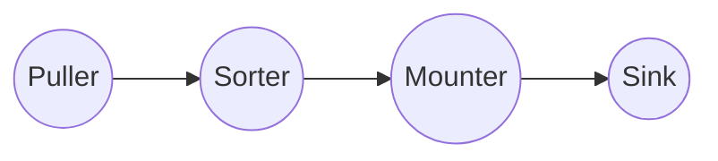
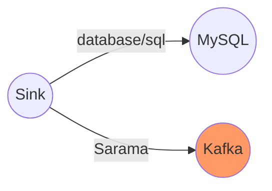

# TiCDC Sink Component

Focus on MQ Sink.

<div class="pt-12">
  <span @click="$slidev.nav.next" class="px-2 py-1 rounded cursor-pointer" hover="bg-white bg-opacity-10">
    Begin <carbon:arrow-right class="inline"/>
  </span>
</div>

---

# Agenda

- **Table pipeline**
- **Sink Interface**
- **Sink Implement**
- **MQ Sink**
<br>
<br>

<style>
h1 {
  background-color: #2B90B6;
  background-image: linear-gradient(45deg, #4EC5D4 10%, #146b8c 20%);
  background-size: 100%;
  -webkit-background-clip: text;
  -moz-background-clip: text;
  -webkit-text-fill-color: transparent;
  -moz-text-fill-color: transparent;
}
</style>

---

# Table Pipeline

Each changefeed creates a processor, and each processor maintains a table pipeline.

### Pipeline
<br>
<br>



---

# Puller

Pull DDL and Row Change data from TiKV.

<div class="puller">

<div>

| Region1       | Region2       |
| ------------- | ------------- |
|               | ts1: C -> 2   |
| ts2: A -> 6   | ts1: Resolved |
| ts1: B -> 4   |               |
| ts1: Resolved |               |
| ts2: B -> 3   | ts2: C ->3    |
| ts2: Resolved |               |
| ts3: A -> 7   |               |

</div>

<div v-click >
<arrow x1="400" y1="300" x2="600" y2="300" width="3" arrowSize="1" />
</div>

<div v-click >

| Output Chan   |
| ------------- |
| ts1: C -> 2   |
| ts2: A -> 6   |
| ts1: B -> 4   |
| ts1: Resolved |
| ts2: B ->3    |
| ts2: C ->3    |
| ts2: Resolved |
| ts3: A -> 7   |

</div>

</div>

<style>
.puller {
  margin-left: 50px;
  margin-right: 100px;
  display: flex;
  justify-content: space-between;
  align-items: center;
}
</style>

---

# Sorter

<div grid="~ cols-3 gap-4">
<div>

| To Sort       |
| ------------- |
| ts1: C -> 2   |
| ts2: A -> 6   |
| ts1: B -> 4   |
| ts1: Resolved |
| ts2: B ->3    |
| ts2: C ->3    |
| ts2: Resolved |
| ts3: A -> 7   |

</div>

<div v-click >
<arrow x1="360" y1="300" x2="600" y2="300" width="3" arrowSize="1" />
</div>

<div v-click >

| Output Chan   |
| ------------- |
| ts1: C -> 2   |
| ts1: B -> 4   |
| ts1: Resolved |
| ts2: A -> 6   |
| ts2: B ->3    |
| ts2: C ->3    |
| ts2: Resolved |

</div>
</div>


---
class: px-20
---

# Mounter

Mounter will use the schema information to convert the row kv
into row changes that TiCDC can handle.

<br/>
<br/>
<br/>

<div grid="~ cols-2 gap-4">
<div>

```go {all|5,7}
type RawKVEntry struct {
	OpType OpType 
	Key    []byte 
	// nil for delete type
	Value []byte 
	// nil for insert type
	OldValue []byte 
	StartTs  uint64 
	// Commit or resolved TS
	CRTs uint64 
	// Additional debug info
	RegionID uint64 
}
```

</div>

<div>

```go {all|9,10}
type RowChangedEvent struct {
	StartTs  uint64 
	CommitTs uint64
	RowID int64 
	Table    *TableName
	ColInfos []rowcodec.ColInfo
	TableInfoVersion uint64 
	ReplicaID    uint64    
	Columns      []*Column 
	PreColumns   []*Column 
	IndexColumns [][]int   
	ApproximateDataSize int64
}
```

</div>
</div>

---

# Sink

Sink is responsible for sending data to Mysql or Kafka.

<div class="sink">



</div>

<style>
.sink {
  display: flex;
  justify-content: center;
  align-items: center;
}
</style>
