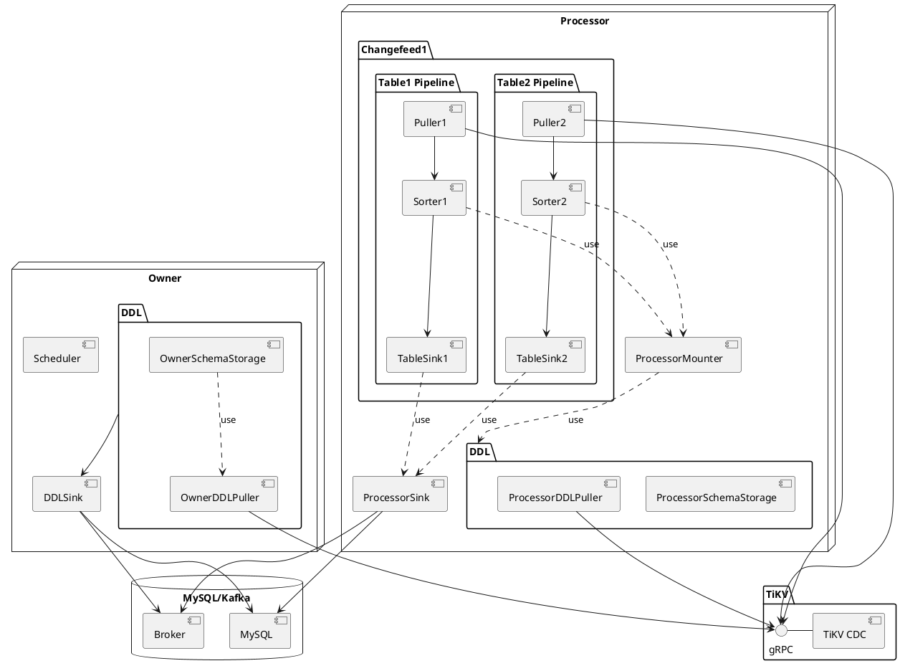
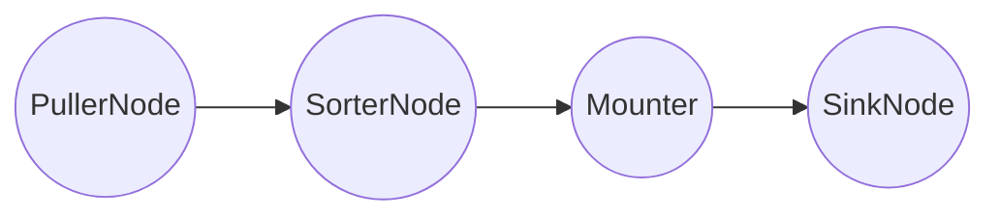
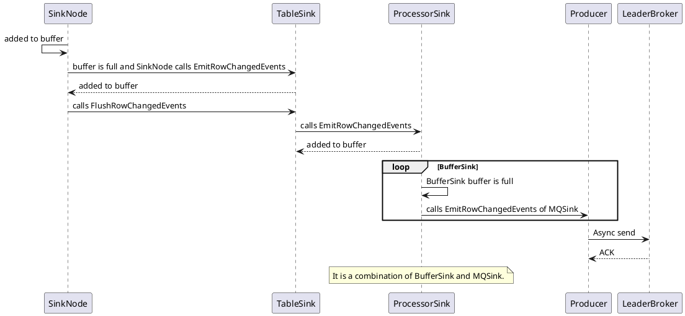
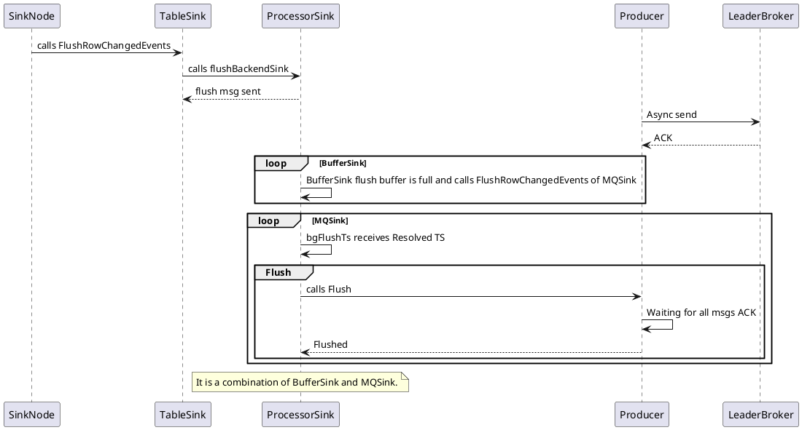
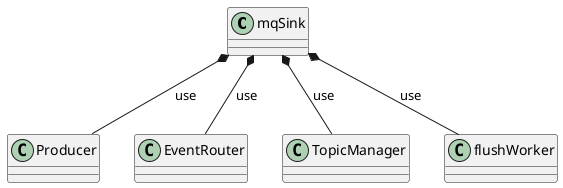
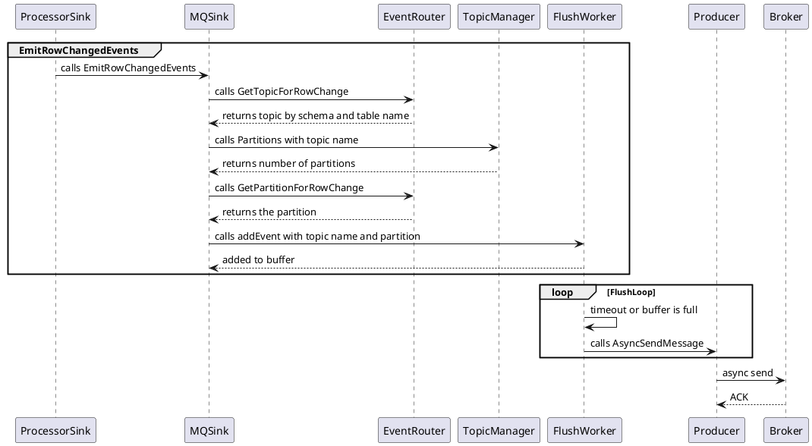
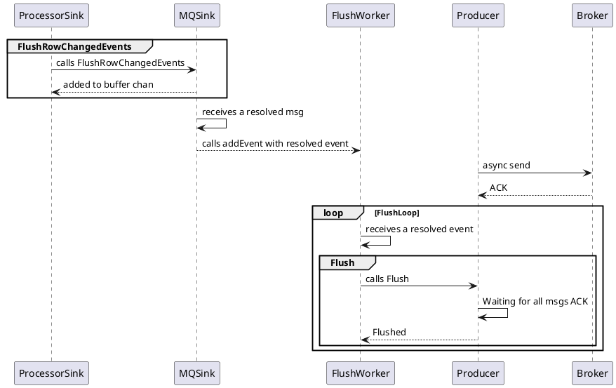
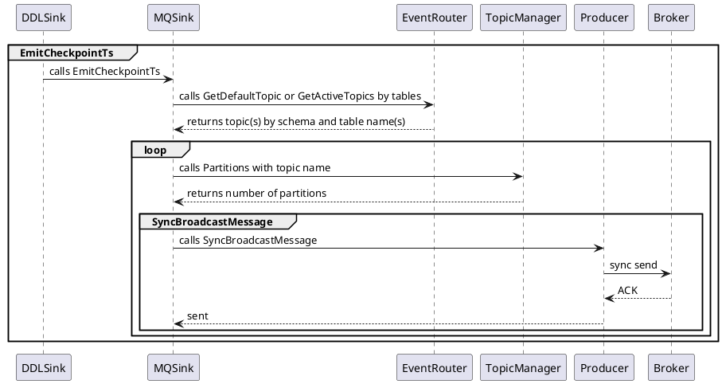

# TiCDC Sink Component

Focus on MQ Sink.

<div class="pt-12">
  <span @click="$slidev.nav.next" class="px-2 py-1 rounded cursor-pointer" hover="bg-white bg-opacity-10">
    Begin <carbon:arrow-right class="inline"/>
  </span>
</div>

---
layout: center
---

# Table pipeline
<br>

# Sink Interface
<br>

# Sink Implement
<br>

# MQ Sink
<br>

# Code View


<style>
h1 {
  background-color: #2B90B6;
  background-image: linear-gradient(45deg, #4EC5D4 10%, #146b8c 20%);
  background-size: 50%;
  -webkit-background-clip: text;
  -moz-background-clip: text;
  -webkit-text-fill-color: transparent;
  -moz-text-fill-color: transparent;
}
</style>

---

<div class="arch">
<div>

# Architecture

</div>

<div
  class="relation"
>

- A TiCDC cluster has only one owner.
- A capture will have multiple processors.
- A processor can only process one changefeed.
- A changefeed can synchronize multiple tables.

</div>

<div>



</div>
</div>

<style>
.arch {
  display: flex;
}

.arch img {
  margin-top: -80px;
}

.relation {
  position: absolute;
  z-index: 1;
  left: 120px;
  top: 60px;
  font-size: 12px;
}

h1 {
  background-color: #2B90B6;
  background-image: linear-gradient(45deg, #4EC5D4 10%, #146b8c 20%);
  background-size: 50%;
  -webkit-background-clip: text;
  -moz-background-clip: text;
  -webkit-text-fill-color: transparent;
  -moz-text-fill-color: transparent;
  writing-mode: vertical-rl;
  text-orientation: mixed;
}
</style>

---

# Table Pipeline

Each changefeed creates a processor, and each processor maintains multiple table pipelines.

### Pipeline
<br>
<br>



---

# Puller

Pull DDL and Row Change data from TiKV.

<div class="puller">

<div>

| Region1       | Region2       |
| ------------- | ------------- |
|               | ts1: C -> 2   |
| ts2: A -> 6   | ts1: Resolved |
| ts1: B -> 4   |               |
| ts1: Resolved |               |
| ts2: B -> 3   | ts2: C ->3    |
| ts2: Resolved |               |
| ts3: A -> 7   |               |

</div>

<div v-click >
<arrow x1="400" y1="300" x2="600" y2="300" width="3" arrowSize="1" />
</div>

<div v-click >

| Output Chan   |
| ------------- |
| ts1: C -> 2   |
| ts2: A -> 6   |
| ts1: B -> 4   |
| ts1: Resolved |
| ts2: B ->3    |
| ts2: C ->3    |
| ts2: Resolved |
| ts3: A -> 7   |

</div>

</div>

<style>
.puller {
  margin-left: 50px;
  margin-right: 100px;
  display: flex;
  justify-content: space-between;
  align-items: center;
}
</style>

---

# Sorter

<div grid="~ cols-3 gap-4">
<div>

| To Sort       |
| ------------- |
| ts1: C -> 2   |
| ts2: A -> 6   |
| ts1: B -> 4   |
| ts1: Resolved |
| ts2: B ->3    |
| ts2: C ->3    |
| ts2: Resolved |
| ts3: A -> 7   |

</div>

<div v-click >
<arrow x1="360" y1="300" x2="600" y2="300" width="3" arrowSize="1" />
</div>

<div v-click >

| Output Chan   |
| ------------- |
| ts1: C -> 2   |
| ts1: B -> 4   |
| ts1: Resolved |
| ts2: A -> 6   |
| ts2: B ->3    |
| ts2: C ->3    |
| ts2: Resolved |

</div>
</div>


---
class: px-20
---

# Mounter

Mounter will use the schema information to convert the row kv
into row changes that TiCDC can handle.

<br/>
<br/>
<br/>

<div grid="~ cols-2 gap-4">
<div>

```go {all|5,7}
type RawKVEntry struct {
	OpType OpType 
	Key    []byte 
	// nil for delete type
	Value []byte 
	// nil for insert type
	OldValue []byte 
	StartTs  uint64 
	// Commit or resolved TS
	CRTs uint64 
	// Additional debug info
	RegionID uint64 
}
```

</div>

<div>

```go {all|9,10}
type RowChangedEvent struct {
	StartTs  uint64 
	CommitTs uint64
	RowID int64 
	Table    *TableName
	ColInfos []rowcodec.ColInfo
	TableInfoVersion uint64 
	ReplicaID    uint64    
	Columns      []*Column 
	PreColumns   []*Column 
	IndexColumns [][]int   
	ApproximateDataSize int64
}
```

</div>
</div>

---

# Sink

Sink is responsible for sending data to MySQL or Kafka.

<div class="sink">


</div>

<style>
.sink {
  display: flex;
  justify-content: center;
  align-items: center;
}
</style>

---

# Sink Interface

<br/>
<br/>
<br/>

```go {all|6}
type Sink interface {
	EmitRowChangedEvents(ctx context.Context, rows ...*model.RowChangedEvent) error

	EmitDDLEvent(ctx context.Context, ddl *model.DDLEvent) error

	FlushRowChangedEvents(ctx context.Context, tableID model.TableID, resolvedTs uint64) (uint64, error)

	// Only for MQ Sink.
	EmitCheckpointTs(ctx context.Context, ts uint64, tables []model.TableName) error

	Close(ctx context.Context) error

	// Only for MySQL Sink.
	Barrier(ctx context.Context, tableID model.TableID) error
}
```

---

# Sink Implement

<br/>
<br/>
<br/>

<div grid="~ cols-3 gap-4">
<div>

## Owner Level Sink
<br/>

- DDL Sink: Sync DDL

</div>

<div>

## Processor Level Sink
<br/>

- BlackHole Sink: Do nothing
- MQSink: For MQ
- MySQLSink: For MySQL
- Buffer Sink: Buffer + Asynchronously

</div>
<div>

## Table Level Sink
<br/>

- Table Sink: Sink Minimum Management Unit

</div>

</div>

---

<div class="relation">

<div class="title">

# Relations

</div>
<div class="uml">


</div>
</div>

<style>
.relation {
  display: flex;
  justify-content: flex-start;
}

.relation img {
  height: 500px;
}

.relation .title {
  flex-grow: 4;
}

.relation .uml {
  flex-grow: 2;
}

h1 {
  background-color: #2B90B6;
  background-image: linear-gradient(45deg, #4EC5D4 10%, #146b8c 20%);
  background-size: 50%;
  -webkit-background-clip: text;
  -moz-background-clip: text;
  -webkit-text-fill-color: transparent;
  -moz-text-fill-color: transparent;
  writing-mode: vertical-rl;
  text-orientation: mixed;
}
</style>

---

# Data Sequence

## Row Change Data Sequence

<br/>



---

# Data Sequence

<div class="seq">
<div>

## Resolved TS Flush Sequence

</div>
<div>



</div>
</div>

<style>
.seq {
  display: flex;
}

h2 {
  writing-mode: vertical-rl;
  text-orientation: mixed;
}
</style>

---

# MQ Sink
<br/>
<br/>

<div class="classes">


</div>

<style>
.classes {
  display: flex;
  justify-content: center;
  align-items: center;
}
</style>

---

# Row Change Data Sequence



---

# Resolved TS Sequence



--- 

# Checkpoint TS Sequence



---
layout: center
class: 'text-center'
---

# Code View

---

# Reference

<div class="ref">

- [TiCDC Architecture](https://docs.google.com/document/d/1gFuvghFOj7OQJqrRSu0LvpMkc9OIL3SbJLTZnBiXehI/edit#)
- [TiCDC multi topic support spec](https://docs.google.com/document/d/15_sivJJzkGO5rCa6uIEyK8mEfzESZpazhWERIY7ZMRs/edit?n=Product_Requirements_Document_Template#heading=h.e4xetqrggxp7)
- [Kafka Producer topic support design](https://docs.google.com/document/d/1bxjq452BS-HoflmsZt-hwMK66GDULpxpOfIVcxQN2hg/edit#heading=h.vvfuksgfwg59)

</div>

<style>
.ref {
  height: 300px;
  display: flex;
  justify-content: center;
  align-items: center;
}
</style>